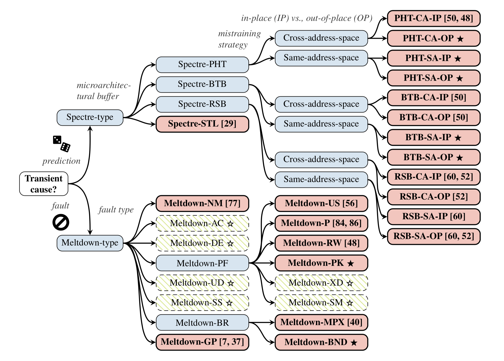

# SpeculativeAttackPoC

you can contract me through email `leeyang1109@163.com`

this project is some simple PoC process about speculative attack such as 

## spectre cluster
* spectre v1 (bounds check bypass,CVE-2017-5753)
* spectre v1.1 (bounds check bypass store,CVE-2018-3693)
* spectre v2 (indirect branch target injection.CVE-2017-5715)
* spectre v3 (rouge data cache load,alternate name:`RDCL`、 `meltdown`,CVE-2017-5754)
* spectre v3a (rouge system register read,CVE-2018-3640)
* spectre v4 (speculative store buffer bypass,CVE-2018-3693)
* spectre v4.1(lazyFP state restore,lazyFP,CVE-2018-3665)
* spectre RSB( return stack buffer,)

## foreshadow cluster
* foreshadow(L1 terminal fault-SGX,CVE-2018-3615)
* foreshadow-NG(l1 terminal fault-OS/SMM,CVE-2018-3620)
* foreshadow-NG (l1 terminal fault-VMM,CVE-2018-3646)

## Microarchitecture Data Samping Attack(MDS)

* RIDL（Rogue In-Flight Data Load; [RIDL official website](https://mdsattacks.com/); [RIDL Paper](https://mdsattacks.com/files/ridl.pdf)）

* Fallout([Fallout official website](https://mdsattacks.com/); [Fallout Paper](https://mdsattacks.com/files/fallout.pdf))

* ZombieLoad([ZombieLoad official website](https://zombieloadattack.com/))

* LVI（[LVI official website](https://lviattack.eu/)）

* CacheOut

* SGAxe

spectre attack is a huge attack cluster,nowtime, the attack cluster is as following picture:

    

## References

1. Paul Kocher, et al. [Spectre Attacks: Exploiting Speculative Execution.](https://spectreattack.com/spectre.pdf) 40th IEEE Symposium on Security and Privacy. San Francisco, USA. May 20-22, 2019.
Moritz Lipp, et al. [Meltdown: Reading Kernel Memory from User Space.](https://meltdownattack.com/meltdown.pdf) 27th USENIX Security Symposium. Baltimore, USA. August 15-17, 2018.
2. Van Bulck, et al. [Foreshadow: Extracting the Keys to the Intel SGX Kingdom with Transient Out-of-Order Execution.](https://foreshadowattack.eu/foreshadow.pdf) 27th USENIX Security Symposium. Baltimore, USA. August 15-17, 2018.
3. [RIDL: Rogue In-Flight Data Load](https://mdsattacks.com/files/ridl.pdf)
4. Claudio Canella, et al. [A Systematic Evaluation of Transient Execution Attacks and Defenses. ](https://arxiv.org/pdf/1811.05441.pdf)arXiv:1811.05441.
5. Daniel Gruss, et al. [KASLR is Dead: Long Live KASLR.](https://gruss.cc/files/kaiser.pdf)9th International Symposium on Engineering Secure Software and Systems. Bonn, Germany. July 4-5, 2017.
Daniel Gruss, et al. [Kernel Isolation: From an Academic Idea to an Effective Patch for Every Computer.](https://www.usenix.org/system/files/login/articles/login_winter18_03_gruss.pdf) USENIX ;login: Winter 2018.
6. Oliverio J. Santana, et al. [A Comprehensive Analysis of Indirect Branch Prediction.](https://citeseerx.ist.psu.edu/viewdoc/download?doi=10.1.1.2.4047&rep=rep1&type=pdf) 4th International Symposium on High Performance Computing. Kansai Science City, Japan. May 15-17, 2002.